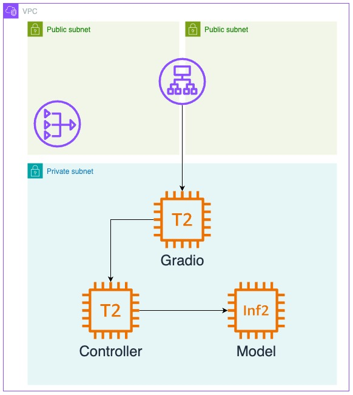

# Chatbot Arena AWS
## システム構成 (WIP)

- Public Subnet
    - FastChat Gradio Web Server
    - Bastion Host
    - NAT Gateway
- Private Subnet
    - FastChat Controller 
    - Model Endpoint

補足:
- NAT Gateway は Private Subnet からのインターネットアクセスのために使用
- Bastion Host は Public/Private Subnet の各インスタンスに SSH するために使用 (デバッグ用)
- 最終的には Gradio Web Server も Private Subnet に配置し、ALB で公開したい

## デプロイ方法 (WIP)
- [Rain](https://github.com/aws-cloudformation/rain) の利用を推奨します
